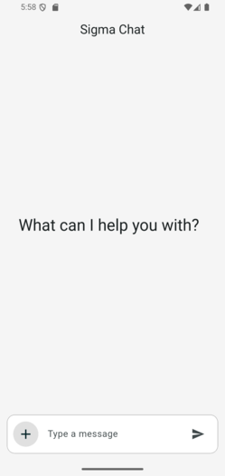
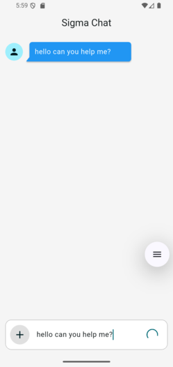
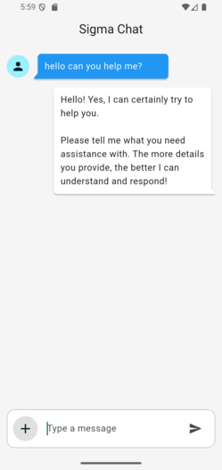
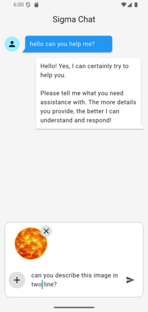
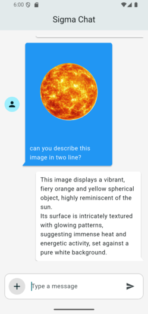
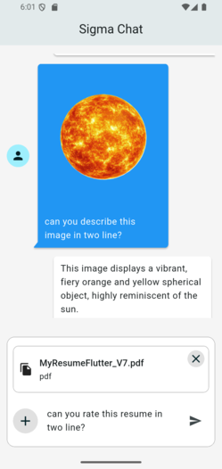
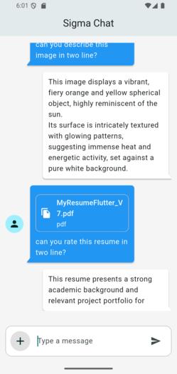
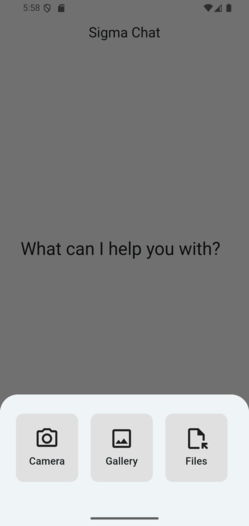

# Sigma Chat

## Description

Sigma Chat is a versatile chat application built with Flutter that leverages the power of Google's Gemini 2.5 flash model for intelligent, multi-modal conversations. The app provides a seamless and interactive user experience, allowing users to send not only text messages but also images and PDF files for analysis. All conversations are stored locally on the device, ensuring that your chat history is persistent across sessions.

The application is built on a robust and scalable architecture, utilizing Flutter for the cross-platform UI, BLoC (Cubit) for state management, and Hive for efficient local database storage.

### Technologies Used

-   **Framework:** Flutter
-   **AI Model:** Google Gemini 2.5 flash (via `firebase_ai`)
-   **State Management:** Flutter BLoC (Cubit)
-   **Local Storage:** Hive
-   **UI:** Material Design, `chat_bubbles` for UI components
-   **File Handling:** `image_picker`, `file_picker`, `syncfusion_flutter_pdf`
-   **Animation:** `animated_text_kit`

## Features

-   **AI-Powered Chat:** Engage in conversations with the Gemini AI model.
-   **Text Messaging:** Send and receive text-based messages.
-   **Image Recognition:** Pick images from the camera or gallery, and send them along with a prompt for the AI to analyze.
-   **PDF File Analysis:** Select PDF files, from which text is automatically extracted and sent to the AI for processing.
-   **Local Chat History:** All messages are saved to a local Hive database, so you never lose your conversations.
-   **Loading & Error States:** The UI provides clear feedback when a message is being sent or if an error occurs.
-   **File Previews:** Preview selected images and files before sending them, with the option to remove them.
-   **Typer Animation:** AI responses are displayed with a typewriter animation for a more engaging chat experience.
-   **User-Friendly Interface:** A clean and intuitive chat interface built with Material Design principles.

## Screenshots

| Initial State                                                    | Basic Message                                              | Basic Message Response                                                 |
| ---------------------------------------------------------------- | ---------------------------------------------------------- | ---------------------------------------------------------------------- |
|            |      |  |
| **Message with Image**                                           | **Message with Image Response**                                | **Message with File**                                                  |
|    |  |          |
| **Message with File Response**                                   | **Add Button**                                             |
|  |            |

## Usage

-   **Sending a Text Message**: Type your message in the text field and press the send button. The AI will respond to your query.
-   **Sending an Image**:
    1.  Click the "Add" button and select "Image".
    2.  Choose an image from your camera or gallery.
    3.  Optionally, add a text prompt to the image.
    4.  Press send. The AI will analyze the image and respond.
-   **Sending a PDF File**:
    1.  Click the "Add" button and select "File".
    2.  Select a PDF file from your device.
    3.  The app will extract the text from the PDF and send it to the AI for analysis.

## Video Shot link

https://drive.google.com/file/d/1-uY6Mqb5b0QTl-SNF0VFRs1bB8lHpsKM/view?usp=sharing


## Project Structure

```
c:\rich_Sonic\sgima_chat\
├───.gitignore
├───analysis_options.yaml
├───firebase.json
├───pubspec.lock
├───pubspec.yaml
├───README.md
├───android\
├───ios\
├───lib\
│   ├───firebase_options.dart
│   ├───main.dart
│   ├───models\
│   │   ├───message_model.dart
│   │   └───message_model.g.dart
│   ├───services\
│   │   ├───chat_services.dart
│   │   ├───hive_local_database.dart
│   │   └───native_services.dart
│   ├───utils\
│   │   ├───app_constants.dart
│   │   ├───app_helper.dart
│   │   ├───routes\
│   │   │   ├───app_router.dart
│   │   │   └───app_routes.dart
│   │   └───theme\
│   │       ├───app_color.dart
│   │       └───app_theme.dart
│   ├───view_model\
│   │   └───chat\
│   │       ├───chat_cubit.dart
│   │       └───chat_state.dart
│   └───views\
│       ├───pages\
│       │   └───chat_page.dart
│       └───widgets\
│           ├───card_message.dart
│           ├───custom_bottom_sheet_item.dart
│           ├───empty_state.dart
│           ├───selected_file_item.dart
│           └───selected_iamge.dart
├───linux\
├───macos\
├───test\
└───windows\
```

-   **`lib/`**: Contains all the Dart code for the application.
    -   **`main.dart`**: The entry point of the application.
    -   **`models/`**: Defines the data models, such as `MessageModel`.
    -   **`services/`**: Handles business logic, including chat services (`chat_services.dart`), local storage (`hive_local_database.dart`), and native functionalities (`native_services.dart`).
    -   **`utils/`**: Contains utility classes, constants, routing, and theme definitions.
    -   **`view_model/`**: Manages the application's state using Cubits from the Flutter BLoC package.
    -   **`views/`**: Contains the UI code, divided into pages and reusable widgets.
-   **`android/`**, **`ios/`**, **`linux/`**, **`macos/`**, **`windows/`**: Platform-specific code and configuration.
-   **`pubspec.yaml`**: Defines project dependencies and assets.

## Installation & Setup

### Prerequisites

-   Flutter SDK installed.
-   A configured Firebase project.

### Steps

1.  **Clone the repository:**
    ```bash
    git clone https://github.com/your-username/sgima_chat.git
    cd sgima_chat
    ```

2.  **Set up Firebase:**
    -   Follow the Firebase documentation to add this app to your Firebase project.
    -   Download your `google-services.json` file and place it in the `android/app/` directory.
    -   Ensure your `lib/firebase_options.dart` file is correctly configured for your Firebase project.

3.  **Install dependencies:**
    ```bash
    flutter pub get
    ```

4.  **Run the code generation:**
    The project uses `hive_generator`. Run the following command to generate the necessary files:
    ```bash
    flutter pub run build_runner build --delete-conflicting-outputs
    ```

5.  **Run the application:**
    ```bash
    flutter run
    ```


## Contributing

Contributions are welcome! If you have any suggestions, bug reports, or feature requests, please open an issue or submit a pull request.

1.  Fork the Project.
2.  Create your Feature Branch (`git checkout -b feature/AmazingFeature`).
3.  Commit your Changes (`git commit -m 'Add some AmazingFeature'`).
4.  Push to the Branch (`git push origin feature/AmazingFeature`).
5.  Open a Pull Request.

## License

This project is licensed under the MIT License. See the `LICENSE` file for more details.

```
MIT License

Copyright (c) 2025 Your Name

Permission is hereby granted, free of charge, to any person obtaining a copy
of this software and associated documentation files (the "Software"), to deal
in the Software without restriction, including without limitation the rights
to use, copy, modify, merge, publish, distribute, sublicense, and/or sell
copies of the Software, and to permit persons to whom the Software is
furnished to do so, subject to the following conditions:

The above copyright notice and this permission notice shall be included in all
copies or substantial portions of the Software.

THE SOFTWARE IS PROVIDED "AS IS", WITHOUT WARRANTY OF ANY KIND, EXPRESS OR
IMPLIED, INCLUDING BUT NOT LIMITED TO THE WARRANTIES OF MERCHANTABILITY,
FITNESS FOR A PARTICULAR PURPOSE AND NONINFRINGEMENT. IN NO EVENT SHALL THE
AUTHORS OR COPYRIGHT HOLDERS BE LIABLE FOR ANY CLAIM, DAMAGES OR OTHER
LIABILITY, WHETHER IN AN ACTION OF CONTRACT, TORT OR OTHERWISE, ARISING FROM,
OUT OF OR IN CONNECTION WITH THE SOFTWARE OR THE USE OR OTHER DEALINGS IN THE
SOFTWARE.
```